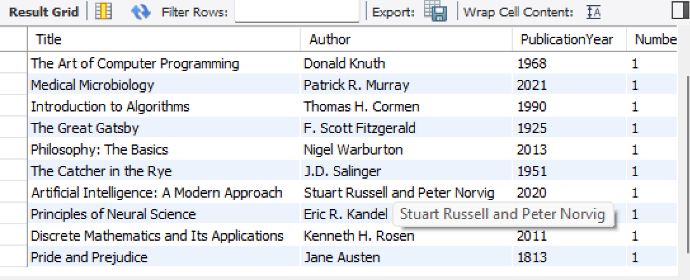
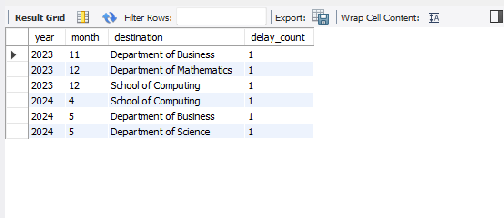
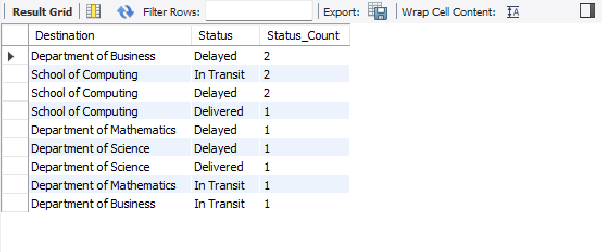

# 📦 SQL Project: Education Logistics Database

This project was completed as part of the **Advanced Databases** module at the **National College of Ireland**, contributing **40%** to the final module grade. The aim was to design and implement a functional **Education Logistics database system** using **MySQL**, simulating how colleges track deliveries such as educational parcels, book content, department addresses, and parcel statuses.

## 🧠 Project Overview

The system is designed to support colleges in managing their internal deliveries and logistics across departments. By analyzing real-time updates, tracking delays, and inspecting the nature of delivery contents, the database enables smoother operations, transparency, and efficient planning.

The tables designed include:

- `parcels`: Information about each delivery (dates, status, location, etc.)
- `destination`: Details of each department or location receiving parcels
- `content`: Items within each parcel
- `status`: Status updates such as "Delivered", "In Transit", "Delayed"

## 📊 SQL Insights Generated

Here are some of the insights and reports generated via SQL queries:

1. **Books and Authors Table**
   

2. **Monthly Delay Count by Destination**
   

3. **Parcel Status Breakdown per Department**
   

4. **Country Mentions Analysis (Bonus Query)**
   

These queries help identify which departments face frequent delays, how many parcels are in transit or delivered, and even provide useful metadata insights like commonly mentioned countries in the content.

## 🧰 Technologies Used

- **MySQL Workbench** for schema design and query execution
- **SQL** (DDL & DML) for creating tables, inserting data, and retrieving insights
- **Manual Data Entry** for simulation purposes
- **Screenshots** to visualize query results

## 📁 Files Included

- `Advanced_Database.sql`: Full SQL script used to create the tables and run the queries
- `CA_Template_2023_24.docx`: Assignment specification document from the college
- `query_output_X.png`: Screenshot results of SQL queries

## 🎯 Outcomes

By the end of the project, the system demonstrated how SQL databases can be tailored to simulate real-world industry needs—in this case, internal parcel delivery and tracking systems within the education sector. The structure makes it easy to scale up, track logistics efficiency, and improve operational performance through data-driven planning.

---
> 💡 This repository is part of the **SQL Projects** collection on this GitHub and may be updated as I complete more personal and academic database projects.
